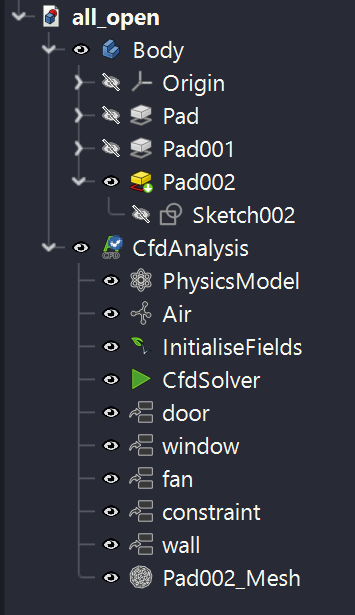
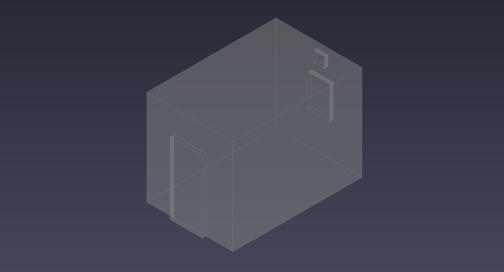
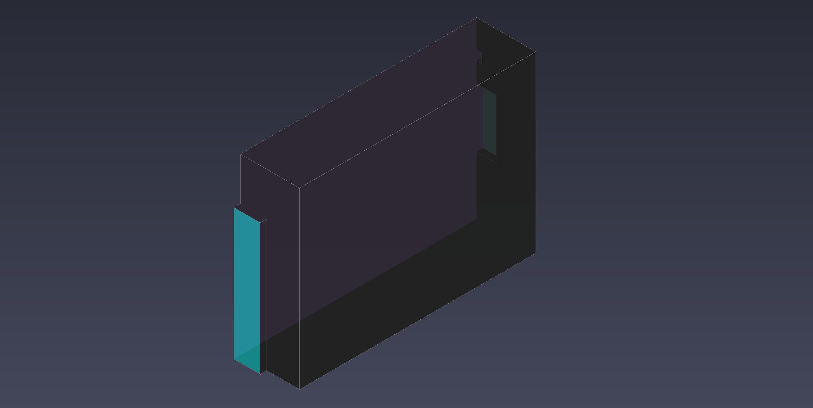
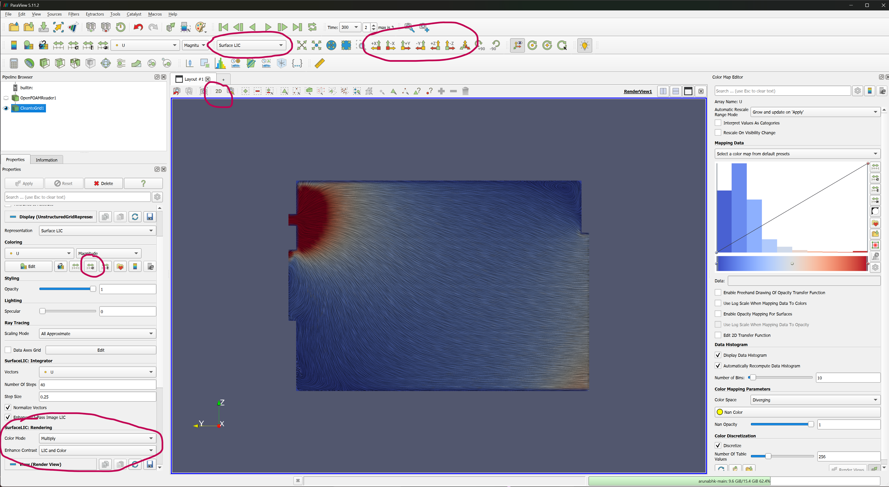
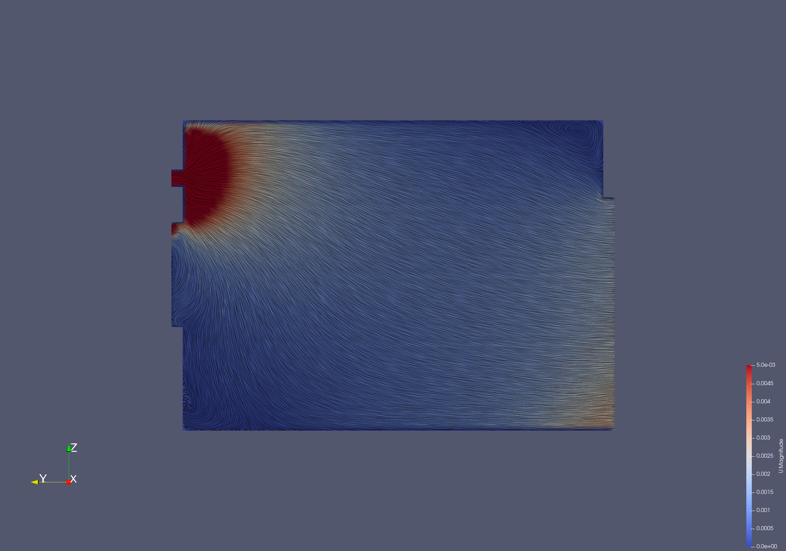
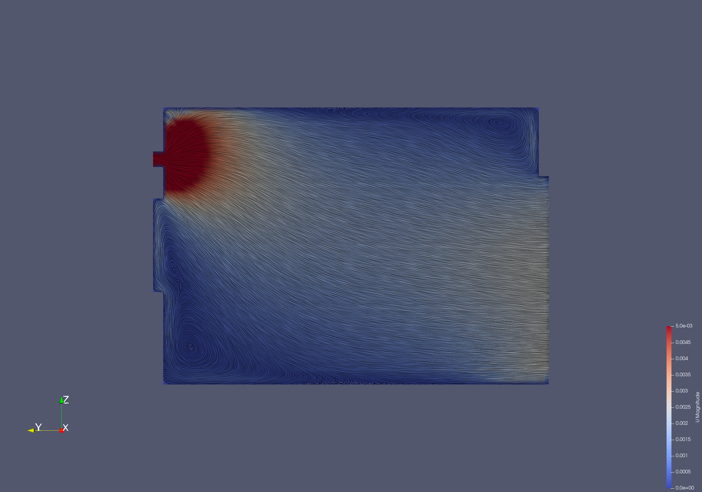
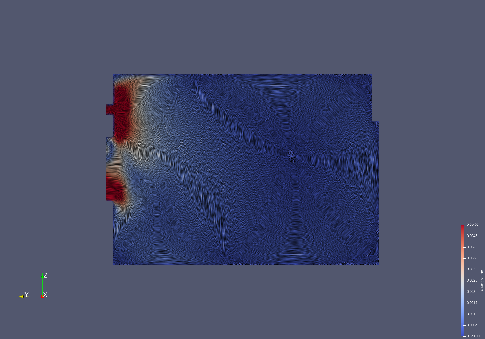

# Room Exhaust CFD Simulation

This project contains a Computational Fluid Dynamics (CFD) simulation of room exhaust scenarios. It uses [OpenFOAM](https://www.openfoam.com/), an open-source CFD software, to simulate the airflow in a room with different ventilation configurations. All tools used in this simulation are free and open-source. This is my first time doing anything CFD related, expect mistakes.


## Quickstart

### Requirements

*   [OpenFOAM](https://www.openfoam.com/): Required to run the simulations
*   [ParaView](https://www.paraview.org/): Used for post-processing and visualization of the results
*   [FreeCAD](https://www.freecadweb.org/) with the [CfdOF AddOn](https://github.com/jaheyns/CfdOF)

## Simulation Cases

The project is structured into three main simulation cases:
- `all_open`: A case with both the door and window open.
- `door_open`: A case with only the door open.
- `window_open`: A case with only the window open.

The simulations are set up to be run in parallel, and the results are stored in the respective case directories.

### Structure



- **Pad002** is the 3d model of room. Actually, its a model of the room cut in half.
- **fan** is a uniform velocity `outlet`. The velocity has been set to $1.14 m/s$, which roughly matches the velocity of a typical exhaust fan
- **window** and **fan** are 2 special (self-explanatory) faces of the room. They are configured as an `open` constraint at atmospheric pressure $101kPa$ when open. While closed, they are defined as a `wall` constraint (no-slip)
- **wall** is all the remaining faces of the model. They are all defined as a `wall` constraint (no-slip)
- **constraint** is the face along the plane which cuts the room into 2 halves. This has been defined as a `symmetry` constraint to allow faster convergence and easier analysis of the CFD results
- **Pad002_Mesh** is the mesh generated using `cfMesh` with a base element size of 50mm.
- **PhysicsModel**, **Air** and **InitialiseFields** contains the physics rules, fluid properties and the initial state respectively

### Running

The simulation can be run as follows:

1. Load the `FCstd` file from one of the three simulation folders in FreeCAD.
2. Double-click on the **CfdSolver** to open the Analysis control task pane
3. Change the `Parallel Cores` property in Data pane to the number of cores on your system
4. Click on `Write` in the Task pane to write the case setup
5. Click on `Run` to start running the simulation. This should open the residuals pane, which will plot the CFD residuals vs iteration on a logarithmic scale
6. Once the simulation is complete, click on `ParaView` in the tasks pane to load the results in paraview
7. (Optional) `File > Load State...` and select the corresponding `.pvsm` file to visualize the results in the exact fashion I loaded them as

## The Story

I started this project because I wanted to figure out the the quickest and most efficient way of freshening up the air in my bathroom. More specifically, I wanted to find out how much of a difference it makes when I open the door, versus when I don't. Is there any risk of the air flowing out of the door instead of the exhaust? Do I need to keep the window open, or does it only mess with the air flow? I wanted to find out the answers to these questions

My bathroom itself looks something like below:



It has a single door on the south wall. It has an exhaust right above a window on the north wall.  
The room is completely symmetric along the YZ-plane, which allowed me to use the following model instead for simulation:



Both of these models were made using FreeCAD and the model files are provided in the `models/` directory.

This allows me to define the XZ-sectional plane as a `symmetry` constraint which drastically reduces my simulation runtime. This also has an added advantage that it makes it easier to reach inside the room to study the airflow once I have my simulation results out. In the full bathroom case, I had to make a slice at the center manually to check the same.

Next, I needed a CFD simulator. OpenFOAM is a highly-capable, free and open-source CFD simulator, which fits perfectly into my requirements, my budget and my philosophy. What it doesn't fit into, is how complicated it is, how it doesn't come with a easy-to-use GUI, and the time required to study and learn how to start simulating anything at all.

The CfdOF workbench for FreeCAD came as a saviour here. It streamlines the entire installation, case setup, constraint definitions, choices of physics models, solvers and initial conditions. I really cannot recommend this project enough for a beginner like me.

For Finite Volume Method meshing I initially used `gmsh`, but it quickly got overwhelmed. So I switched to `cfMesh` which drastically improved my mesh quality, and simulation accuracy and speed.

### My System

```
OS: Windows 11
CPU: AMD Ryzen 7 4800H with 8 cores and 16 threads
GPU: NVIDIA GeForce RTX 3050 Laptop
RAM: 16GB
```

### Installation

1. Install FreeCAD from its official [website](https://www.freecadweb.org/).
2. Start FreeCAD and install the CfdOF addon from `Tools > Addon Manager...`
3. Go to `Edit > Preferences...> CfdOF` and install OpenFOAM, Paraview and cfMesh

> Note: if you are using Windows, installing OpenFOAM will install the blueCFD release. This comes included with a ParaView binary and you can point to it directly instead of installing again

4. Update the executable paths in the same window on top. It looks something like this in my case:


### Running

1. Create the model of the room using the Part Design workbench in FreeCAD.
2. Go to the CfdOF workbench and start a CFD analysis.
3. Define the inlets, outlets, walls, and symmetry constraints using the `Fluid Boundary` option.
    a. The **exhaust** face is selected and defined as an outlet with uniform velocity of $1.14m/s$ in the Y-direction
    b. The **door** and **window** faces are defined as "open" with pressure $101kPa$ or as a "wall" when closed
    c. The **symmetry** plane is defined as `Constraint > Symmetry`
    d. All remaining faces are selected and added as a `wall` with the default no-slip attribute
4. Define the physics model. In our case, we are performing a Steady state analysis, in a single-phase, isothermal flow, with RANS turbulence modelling using the kOmegaSST method. This sets the solver to `simpleFoam` which is ideal for an incompressible approximation such as this.
5. Use the `Add Fluid Properties` option and choose the "Air" preset.
6. Use the `Initialise` option and set:  
    a. initial pressure inside the room as $101kPa$  
    b. velocity as "Potential flow". This lets the `potentialFoam` solver define a good velocity gradient for you.
7. Go to the `CFD Mesh` option and chose `cfMesh` as the mesher and define $50mm$ as the base element size. Then write the mesh case, and run the mesher. Also run `Check Mesh` to ensure there aren't any errors
8. Finally, go to the `CfdSolver` option:  
    a. Change the `Parallel Cores` option in the `Data` panel to your number of cores (NOT number of parallel threads). Also change the `Max Iterations` number to 400 which is reasonable for these testcases  
    b. `Write` the simulation case. This will write out all the directories (`system`, `constant`, `0`) and files used by OpenFOAM in the Temp directory  
    c. (Optional) `Edit` the simulation case. You can manually modify the case files to change the algorithms and solvers in order to get better stability/accuracy in your simulation. In our case, no change was required for convergence.  
    d. `Run` the simulation case. This will automatically pop up the `Residuals` window which will plot how the solutions are converging over the iterations. It will ideally stop when steady state is reached, but more commonly it will continue solving until it reaches the Max Iterations limit. If you see that the residuals do not change significantly after a certain number, it might be a good idea to reduce your `Max Iterations` attribute to that to save runtime. 


> The project follows the standard OpenFOAM case structure. Each case directory contains the following subdirectories:
> 
> - `0`: Contains the initial and boundary conditions for the flow variables (e.g., `U` for velocity, `p` for pressure).
> - `constant`: Contains the mesh (`polyMesh`) and physical properties of the fluid (`transportProperties`).
> - `system`: Contains the settings for the simulation, such as solver settings (`controlDict`, `fvSolution`), numerical schemes (`fvSchemes`), and parallel processing settings (`decomposeParDict`).
>
> These are all stored in the Temp directory by default and can be easily copied over to a more permanent directory (e.g. `all_open`) with the help of the `Edit` button
    

### Visualisation

> Image guide below

1. Click on the `ParaView` button in the `CfdSolver` task window to load up the results
2. Change mode to 2D, and use the view direction buttons to select your view
3. Change the data to Velocity `U` and mode to `Surface LIC`
4. Change the scale using the Custom range button. $[0, 0.005]$ is a good range for this simulation
5. Change the Surface LIC rendering to `Multiply` and `LIC and color` enhanced to make the lines pop up

You can now see the streamlines of the air flowing inside the room, along with the associated velocity.



## Simulation Results

Here are some visualizations of the different simulation cases.

| | |
| :---: | :---: |
| All Open |  |
| Door Open |  |
| Window Open |  |

As expected, keeping the open drastically improves the airflow, which is in line with my expectations. What is interesting to note is that half of the bathroom sees nearly zero outflow when the door is closed, which severly hurts airflow.

Opening or not opening the window doesn't have a huge impact on the flow. There is some recirculation with the outside air happening in a vortex close to the window, but it's not significant. What is significant, is that closing the window increases the velocity of the air at the center of the room, somewhat increasing the airflow.

That makes the "Door open, window closed" as the best possible scenario for clearing up the bathroom air, with the "All open" case a close second.

## Tutorials

- [FreeCAD by Deltahedra](https://www.youtube.com/watch?v=E14m5hf6Pvo)
- [CfdOF by TechBernd](https://www.youtube.com/watch?v=OS4sbbBtZUw&list=PL9H9jQE7y0a5jhlyACRzsdfnx-42AYCCX&index=2)
- [ParaView by AirShaper](https://www.youtube.com/watch?v=kczZPc4M-ms)